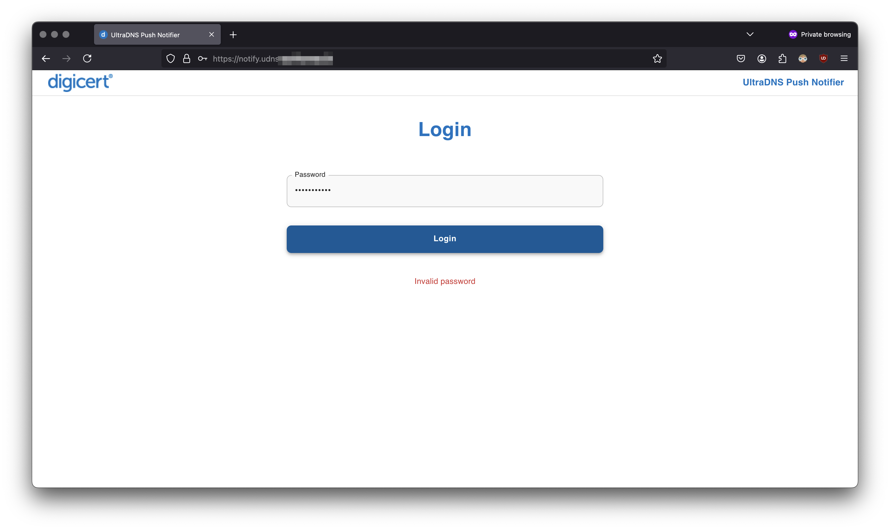

# frontend

This document provides an overview of the workflow, accompanied by screenshots.

## Setting an Admin Password

The first time the app is started, you’ll be prompted to set an admin password. This password is stored in the database, which is mounted to a local volume and persists through container tear-downs.

## Choose a Platform

You’ll be prompted to select a platform to push notifications to.

For this example, we are selecting Microsoft Teams.

## Enter a Webhook

The application will prompt you to enter a webhook URL for the selected platform. A test message will be sent to verify connectivity.

To help you generate a webhook URL, an accordion menu provides step-by-step instructions for the selected platform. Below is an example for creating a webhook for Teams

## Verify UltraDNS Telemetry

You’ll then be prompted to verify connectivity with UltraDNS. The app will automatically generate an endpoint URL that must be added to your UltraDNS account settings under "Notification Settings."

Detailed instructions for navigating the UltraDNS UI can be accessed through the expandable accordion menu.

Once you click the "Test Connection" button in UltraDNS, the app will detect the response and proceed automatically to the Dashboard.

## Dashboard View

Upon successful configuration, the Dashboard displays a summary of your webhooks.

## Adding Additional Webhooks

To add another webhook, click the "Add Webhook" button on the Dashboard. This will take you back to the setup workflow. For this example, Slack has been selected.

The setup will once again enter a state where it waits for test telemetry to confirm the webhook connection.

Use the provided endpoint in your UltraDNS settings.

Once confirmed, all configured webhooks will appear in the Dashboard view.

## Logging In

After setting the admin password, you’ll need to log in using the password on subsequent visits.

